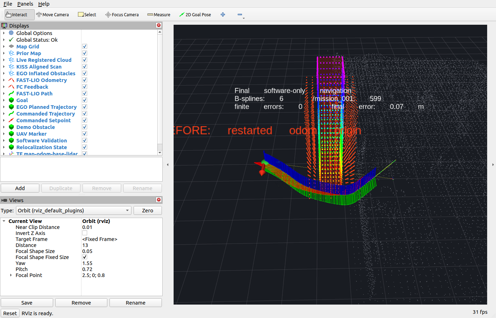
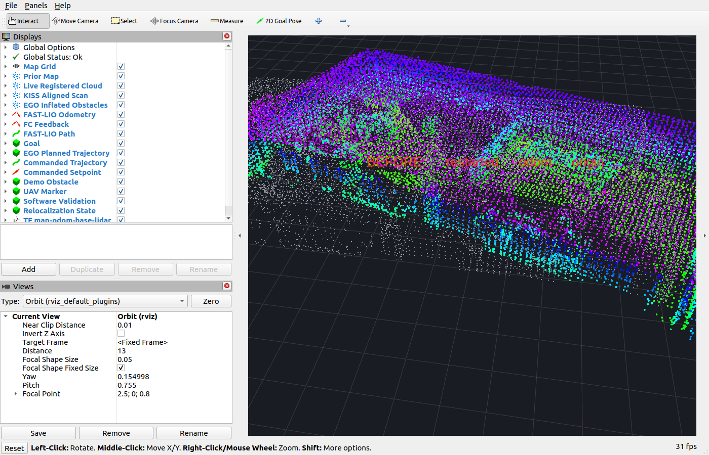
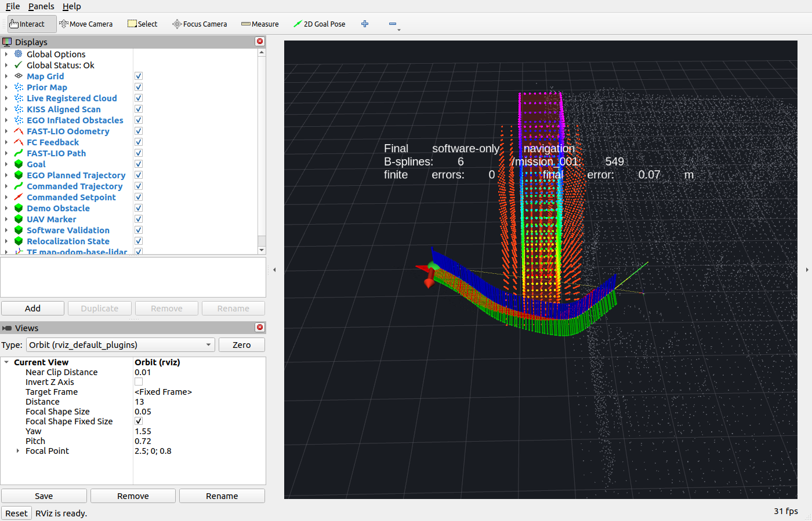
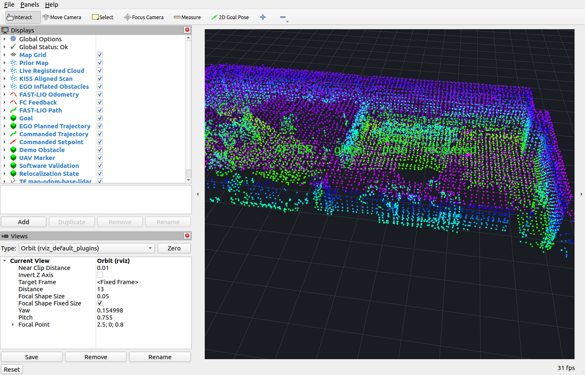

# AeroMind

**A LiDAR-based Spatial Intelligence System for GNSS-denied UAV Autonomy**

AeroMind 是面向 GNSS 拒止环境的机载无人机空间智能框架。系统以 Jetson Orin NX 为计算平台，使用 Livox Mid-360 提供三维点云与惯性数据，在 ROS 2 Humble 下连接 FAST-LIO、EGO-Planner、KISS-Matcher 与 Fancinnov Mcontroller V7，实现从环境感知、连续定位、局部建图到目标导航、避障轨迹执行和旧地图重定位的完整链路。

## 项目简介

AeroMind 将激光惯性里程计、局部规划、轨迹执行与飞控外部定位统一在同一套坐标系和 ROS 接口中，主要功能包括：

- Livox Mid-360 点云与 IMU 实时接入
- FAST-LIO 激光惯性定位与局部建图
- FAST-LIO 位姿向 Mcontroller 外部定位接口注入
- RViz 2D Goal Pose 点击目标导航
- EGO-Planner 三维局部轨迹规划与障碍物绕行
- 非均匀 B-spline 轨迹采样与飞控位置设定点输出
- PCD 地图保存与 KISS-Matcher 地图重定位
- `map → odom → base_link → lidar_link` TF 管理
- 地图、实时点云、机体、目标和轨迹的 RViz2 综合显示

本仓库保留项目自有的 ROS 2 glue code、launch、参数、演示地图与可视化资源；第三方算法位于 `src/third_party/`，其版权与许可证归各上游项目所有。

## 系统架构

```text
                              ┌────────────────────┐
                              │       RViz2        │
                              │ Goal / Map / Path  │
                              └─────────┬──────────┘
                                        │ /goal_pose
                                        ▼
┌──────────────┐   ┌────────────────┐   ┌──────────────────┐
│ Livox        │   │ SPARK          │   │ EGO-Planner      │
│ Mid-360      ├──►│ FAST-LIO       ├──►│ Local Planning   │
└──────────────┘   └───────┬────────┘   └────────┬─────────┘
                            │                     │ /planning/bspline
                            │                     ▼
                            │            ┌──────────────────┐
                            │            │ Trajectory       │
                            │            │ Executor         │
                            │            └────────┬─────────┘
                            │                     │ /mission_001
                            ▼                     ▼
                   Local odometry        ┌──────────────────┐
                   Local mapping         │ fcu_bridge_001   │
                                        │ Mcontroller V7   │
                                        └──────────────────┘
```

全局地图对齐作为独立分支运行：

```text
prior map (map) ──────────────┐
                              ├──► KISS-Matcher ──► T_map_odom
current registered scan (odom)┘

map ──► odom ──► base_link ──► lidar_link
```

FAST-LIO 始终维护连续局部里程计。重定位模块只发布 `map → odom`，不会重置 FAST-LIO，也不会向飞控注入全局地图修正。

## Hardware Platform

| 组件 | 配置 | 职责 |
|---|---|---|
| 机载计算机 | NVIDIA Jetson Orin NX 16GB | 运行 ROS 2、定位、规划、重定位与可视化节点 |
| 激光雷达 | Livox Mid-360 | 输出三维 PointCloud2 与 IMU 数据 |
| 飞控 | Fancinnov（Fanci）Mcontroller V7 | 姿态稳定、位置控制与 MAVLink 目标执行 |
| 操作系统 | Ubuntu 22.04 LTS / aarch64 | Jetson 运行环境 |
| ROS | ROS 2 Humble | 节点通信、TF、launch 与 RViz2 |


## Software Stack

| 组件 | 位置 | 责任边界 |
|---|---|---|
| ROS 2 Humble | 系统环境 | 通信、参数、TF、服务与进程编排 |
| livox_ros_driver2 | `src/third_party/livox_ros_driver2/` | Mid-360 点云和 IMU 驱动 |
| SPARK FAST-LIO | `src/third_party/spark-fast-lio/` | 连续激光惯性里程计与 registered cloud |
| EGO-Planner-Swarm | `src/third_party/ego-planner-swarm/` | 局部占据地图、轨迹搜索、优化与 B-spline 输出 |
| KISS-Matcher | `src/third_party/KISS-Matcher/` | 当前扫描到先验地图的刚体配准 |
| RViz2 | ROS 2 环境 | 地图、点云、TF、目标和轨迹可视化 |
| uav_bringup | `src/uav_bringup/` | AeroMind 参数、launch、RViz 与 LIO-to-FC 适配 |
| uav_planning | `src/uav_planning/` | 目标适配、轨迹执行、地图保存与重定位 |
| Fancinnov FC stack | 独立 ROS 2 工作区 | `fcu_bridge_001` 与 Mcontroller MAVLink 通信 |

## Coordinate System

```text
map
  │  KISS-Matcher relocalizer: T_map_odom
  ▼
odom
  │  FAST-LIO: T_odom_base
  ▼
base_link
  │  static transform
  ▼
lidar_link
```

- `map`：先验 PCD 所在的全局固定坐标系。
- `odom`：当前 FAST-LIO 会话的连续局部世界坐标系。
- `base_link`：FAST-LIO 跟踪的 IMU/body 参考。
- `lidar_link`：Livox Mid-360 激光坐标系。

系统使用：

```text
T_map_base = T_map_odom × T_odom_base
```

FAST-LIO 负责 `odom → base_link`；KISS 重定位负责 `map → odom`。全局地图对齐变化只影响全局显示和 map-frame 目标转换，飞控继续消费连续的 odom-frame 位姿。

当前 `base_link → lidar_link` 静态平移为 `[-0.011, -0.02329, 0.04412] m`，旋转为单位阵。机械安装改变后必须重新标定。

飞控链路沿用实物轴向关系：

```text
ROS / FAST-LIO FLU        MAVLink local NED
x                    ───► x
y                    ───► -y
z                    ───► -z
yaw                  ───► -yaw
```

## ROS Interface

### 传感器与定位

| Topic | Message | Purpose |
|---|---|---|
| `/livox/lidar` | `sensor_msgs/msg/PointCloud2` | Mid-360 激光点云输入 |
| `/livox/imu` | `sensor_msgs/msg/Imu` | Mid-360 惯性输入 |
| `/odometry` | `nav_msgs/msg/Odometry` | FAST-LIO 连续局部位姿，`odom → base_link` |
| `/cloud_registered` | `sensor_msgs/msg/PointCloud2` | odom-frame 配准点云，供地图、规划和重定位使用 |
| `/path` | `nav_msgs/msg/Path` | FAST-LIO 轨迹显示 |
| `/uav/planning/odometry` | `nav_msgs/msg/Odometry` | EGO 与轨迹执行器使用的统一里程计 |
| `/odometry_001` | `nav_msgs/msg/Odometry` | 发送给 Mcontroller bridge 的外部定位，20 Hz |
| `/odom_global_001` | `nav_msgs/msg/Odometry` | 飞控侧位置反馈 |

### 规划与执行

| Topic | Message | Purpose |
|---|---|---|
| `/goal_pose` | `geometry_msgs/msg/PoseStamped` | RViz 统一目标入口 |
| `/move_base_simple/goal` | `geometry_msgs/msg/PoseStamped` | goal adapter 输出的 EGO 目标 |
| `/uav/planning/goal` | `geometry_msgs/msg/PoseStamped` | odom-frame 目标与固定飞行高度 |
| `/grid_map/occupancy_inflate` | `sensor_msgs/msg/PointCloud2` | EGO 局部膨胀障碍物 |
| `/planning/bspline` | `traj_utils/msg/Bspline` | EGO 非均匀 B-spline 轨迹 |
| `/uav/planning/planned_trajectory` | `visualization_msgs/msg/Marker` | 规划轨迹显示 |
| `/uav/planning/commanded_setpoint` | `geometry_msgs/msg/PoseStamped` | 当前轨迹设定点显示 |
| `/uav/planning/executed_trajectory` | `nav_msgs/msg/Path` | 已发送设定点路径 |
| `/mission_001` | `std_msgs/msg/Float32MultiArray` | Mcontroller 位置目标输入 |

`/mission_001` 的 11 个字段为：

```text
[yaw, yaw_rate, x, y, z, vx, vy, vz, ax, ay, az]
```

当前控制语义为 20 Hz `POSITION_ONLY`。飞控 type mask `0x09f8` 启用 XYZ 与 yaw，速度、加速度和 yaw rate 字段保持为零。

### 地图、重定位与 TF

| Topic / Service | Message | Purpose |
|---|---|---|
| `/prior_map` | `sensor_msgs/msg/PointCloud2` | map-frame 先验地图 |
| `/relocalization/aligned_cloud` | `sensor_msgs/msg/PointCloud2` | 配准后的当前扫描 |
| `/relocalization/status` | `std_msgs/msg/String` | 重定位运行状态 |
| `/relocalize` | `std_srvs/srv/Trigger` | 使用最新扫描更新 `map → odom` |
| `/save_map` | `std_srvs/srv/Trigger` | 保存累积 registered cloud 为 PCD |
| `/tf` | `tf2_msgs/msg/TFMessage` | `map → odom` 与 `odom → base_link` |
| `/tf_static` | `tf2_msgs/msg/TFMessage` | `base_link → lidar_link` |

## Navigation Pipeline

```text
RViz 2D Goal Pose
        │
        ▼
   /goal_pose
        │
        ▼
 Goal Adapter ──► map-to-odom transform + fixed Z
        │
        ▼
 EGO-Planner ──► /planning/bspline
        │
        ▼
 Trajectory Executor ──► p(t), v(t), a(t), yaw(t)
        │
        ▼
 /mission_001 ──► fcu_bridge_001 ──► Mcontroller V7
```

RViz 点击提供目标 XY，拖动方向提供 yaw；飞行高度由 `flight_height` 参数统一设置，默认 1.0 m。goal adapter 接受 map 或 odom 目标，并在送入 EGO 前统一转换到 odom。轨迹执行器按 B-spline knots、order、control points 和 start time 重建轨迹，以 steady clock 连续采样位置和航向，再通过既有 FC bridge 发送目标。

`enable_flight_commands` 是 `/mission_001` 的显式软件门控，默认值为 `false`。AeroMind 不自动执行 ARM、起飞、降落或遥控模式切换，这些操作由现场操作员和飞控安全逻辑负责。

## Relocalization

KISS-Matcher 使用当前 odom-frame registered scan 作为 source，使用 map-frame PCD 作为 target。求解结果方向为：

```text
T_target_source = T_map_odom
```

可选粗略初值通过 `initial_x`、`initial_y`、`initial_z` 和 `initial_yaw` 参数提供。调用 `/relocalize` 后，节点读取最新扫描、完成匹配并更新 `map → odom`；`/odometry` 数值、FAST-LIO 内部状态和 Mcontroller 外部定位链保持连续。

演示资产位于：

```text
maps/demo/lab_map.pcd
maps/demo/lab_restart_scan.pcd
```

普通建图生成的 PCD 位于 `maps/`，默认不进入版本控制；需要长期发布的地图应经过审阅后放入 `maps/demo/` 或 `maps/final/`。

## Visualization

最终 RViz 配置为 `src/uav_bringup/config/uav_final.rviz`，Fixed Frame 使用 `map`，集中显示：

- 先验地图与实时 registered cloud
- KISS 对齐点云与 TF 树
- UAV 当前位姿与 FAST-LIO 路径
- RViz 点击目标
- EGO 障碍物与规划轨迹
- 轨迹执行器设定点和已执行路径
- 可用的飞控位置反馈











## Build

### 环境依赖

- Ubuntu 22.04
- ROS 2 Humble Desktop
- CMake 3.24 或更高版本（KISS-Matcher wrapper）
- Livox-SDK2
- PCL、Eigen3、TBB、FLANN、GTSAM
- 独立安装的 Fancinnov ROS 2 FC stack

### 编译命令

```bash
cd /path/to/AeroMind
source /opt/ros/humble/setup.bash

colcon build \
  --packages-up-to uav_bringup \
  --symlink-install \
  --cmake-args \
    -DCMAKE_BUILD_TYPE=Release \
    -DROS_EDITION=ROS2 \
    -DDISTRO_ROS=humble

source install/setup.bash
```

若 FC stack 使用独立工作区，在运行 AeroMind 前 source 其 `install/setup.bash`。

## Run

以下命令假定 AeroMind 已编译，Fancinnov FC stack 已安装，并已配置 Mid-360 网口与串口权限。

```bash
export AEROMIND_WS=/path/to/AeroMind
export FANCI_WS=/path/to/fancinnov_ws/fcu_core_ros2_ws

source /opt/ros/humble/setup.bash
source "$AEROMIND_WS/install/setup.bash"
source "$FANCI_WS/install/setup.bash"
export ROS_LOG_DIR="$AEROMIND_WS/runtime_logs/ros"
```

### Mapping

```bash
ros2 launch uav_bringup mapping.launch.py \
  map_path:="$AEROMIND_WS/maps/session_map.pcd" \
  rviz:=true
```

保存当前累积地图：

```bash
ros2 service call /save_map std_srvs/srv/Trigger '{}'
```

### Navigation

```bash
ros2 launch uav_bringup autonomous_demo.launch.py \
  use_relocalization:=true \
  map_path:="$AEROMIND_WS/maps/demo/lab_map.pcd" \
  flight_height:=1.0 \
  enable_flight_commands:=true \
  rviz:=true
```

系统启动后，在 RViz 中使用 **2D Goal Pose** 点击目标位置并拖动目标航向。

### Relocalization

```bash
ros2 param set /kiss_relocalizer initial_x 0.0
ros2 param set /kiss_relocalizer initial_y 0.0
ros2 param set /kiss_relocalizer initial_z 0.0
ros2 param set /kiss_relocalizer initial_yaw 0.0
ros2 service call /relocalize std_srvs/srv/Trigger '{}'
```

### Visualization

当主 launch 使用 `rviz:=false` 时，可单独启动界面：

```bash
rviz2 -d "$AEROMIND_WS/src/uav_bringup/config/uav_final.rviz"
```

## Project Structure

```text
AeroMind/
├── .gitignore
├── LICENSE
├── README.md
├── docs/
│   └── images/
│       └── final_demo/
│           ├── 01_system_overview.png
│           ├── 02_live_mapping.png
│           ├── 03_goal_and_ego_planning.png
│           ├── 04_obstacle_avoidance.png
│           ├── 05_relocalization_before.png
│           ├── 06_relocalization_after.png
│           └── 07_final_navigation_view.png
├── maps/
│   └── demo/
│       ├── lab_map.pcd
│       └── lab_restart_scan.pcd
├── src/
│   ├── third_party/
│   │   ├── KISS-Matcher/
│   │   ├── ego-planner-swarm/
│   │   ├── livox_ros_driver2/
│   │   └── spark-fast-lio/
│   ├── uav_bringup/
│   │   ├── config/
│   │   ├── launch/
│   │   └── src/
│   └── uav_planning/
│       ├── config/
│       ├── scripts/
│       └── src/
└── tools/
```

`build/`、`install/`、`log/`、运行日志、bag、遥测数据和普通生成 PCD 均属于本地产物，不进入版本控制。

## Engineering Notes

### 传感器安装

- Mid-360 与机体之间需要刚性安装，避免结构振动和相对位移。
- Orin、DC/DC 与线束应独立固定并做好应力释放，不得压迫飞控减振结构。
- 机械结构、雷达位置或 IMU 安装改变后，需要重新测量外参并更新静态 TF。

### 坐标标定

- 使用机头前进、机体左移、垂直上移和航向旋转逐轴确认坐标符号。
- FAST-LIO、EGO、地图保存和 KISS 输入必须共享一致的 odom 数值语义。
- `map → odom` 只用于全局对齐，不写回 FAST-LIO，也不用于改变飞控连续位姿。

### 供电与重心

- Jetson、Mid-360 和飞控应采用满足峰值电流需求的稳定供电与可靠接地。
- 应关注电机负载下的电池压降，而不是仅依据空载电压判断供电能力。
- 载荷、电池和计算单元应围绕机体重心布置；机械调整后重新检查姿态裕量与标定参数。

### 机载部署

- 使用 `/dev/serial/by-id/` 固定飞控串口，避免 USB 枚举顺序变化。
- 雷达网口使用独立静态子网，不改变无线网络默认路由。
- 将 `ROS_LOG_DIR` 指向 `runtime_logs/`，并定期清理日志与录包文件。
- RViz 是操作与观察界面，不作为飞行控制链的运行依赖。

## Third-party Components

第三方源码与各自许可证保留在 `src/third_party/`：

- Livox ROS Driver 2
- SPARK FAST-LIO
- EGO-Planner-Swarm
- KISS-Matcher

AeroMind 的项目自有部分负责这些组件之间的 ROS 2 接口、坐标语义、启动编排、目标适配、轨迹执行、地图保存、重定位 TF 与可视化集成。


